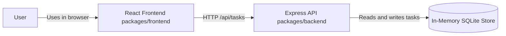
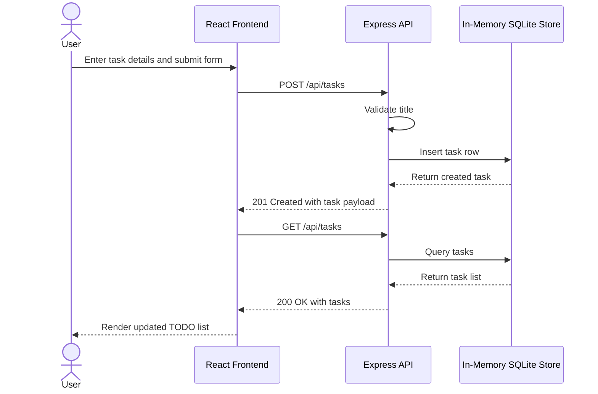

# Cloud Architecture Overview

This monorepo contains a React frontend, an Express API, and an in-memory SQLite task store.

## System Context

```mermaid
flowchart LR
    U[User]
    F["React Frontend packages/frontend"]
    A["Express API packages/backend"]
    D[(In-Memory SQLite Store)]

    U -->|Uses in browser| F
    F -->|HTTP /api/tasks| A
    A -->|Reads and writes tasks| D
```

## Create TODO Sequence

```mermaid
sequenceDiagram
    actor U as User
    participant F as React Frontend
    participant A as Express API
    participant D as In-Memory SQLite Store

    U->>F: Enter task details and submit form
    F->>A: POST /api/tasks
    A->>A: Validate title
    A->>D: Insert task row
    D-->>A: Return created task
    A-->>F: 201 Created with task payload
    F->>A: GET /api/tasks
    A->>D: Query tasks
    D-->>A: Return task list
    A-->>F: 200 OK with tasks
    F-->>U: Render updated TODO list
```